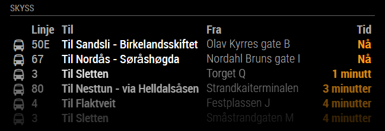
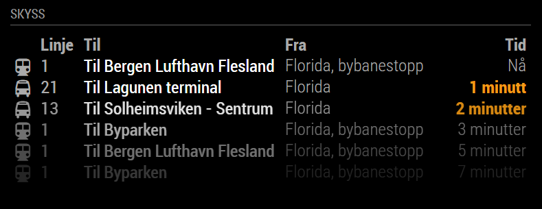

# MagicMirror² Module: Skyss
'MMM-Skyss' is a module based on the Ruter equivalent made by Cato Antonsen for displaying public transport information for the Hordaland region in Norway on a [MagicMirror²](https://magicmirror.builders/). It's using data from Skyss.no. Skyss is a registered trademark of Hordaland County Councile (Hordaland Fylkeskommune) which is not affiliated with this product. Content from Skyss APIs may be copyrighted.


 

Current version is s1.3.0 See [changelog](CHANGELOG.md "Version history") for version history.

## Installation

Remote to your MM2-box with your terminal software and go to your MagicMirror's Module folder:
````bash
cd ~/MagicMirror/modules
````

Clone the repository:
````bash
git clone https://github.com/PabloDons/MMM-Skyss.git
````

Go to the modules folder:
````bash
cd MMM-Skyss
````

Install the dependencies:
````bash
npm install
````

Add the module to the modules array in the `config/config.js` file by adding the following section. You can change this configuration later when you see this works:
```javascript
{
	module: 'MMM-Skyss',
	header: 'Skyss',
	position: 'top_left',
	config: {
		showPlatform: true,
		maxItems: 8,
		stops: [
			{
				stopId: "12011092"
			},
			{
				stopId: "12011022"
			},
		]
	}
},
```

# Configuration options

These are the valid configuration options you can put inside the config array above:

Configuration option | Comment | Default 
---|---|---
stops | Array of stops. See below | Empty array
maxItems | Number of journeys to display | 5 
showHeader | Set this to true to show header above the journeys | false
showStopName | Display custom stop name for each stop. You can override the name by adding `stopName` to the stop you want to override (See below) | false
maxNameLength | Some stop names can be very long and ruin the layout of the module. Set this to how many characters you max want to display.  | Not set
showPlatform | Set this to true to get the names of the platforms. Set this to true to check the name of the platform if you need to filter  | false
humanizeTimeTreshold | If time to next journey is below this value, it will be displayed as "x minutes" instead of time | 15 
serviceReloadInterval | Refresh rate in MS for how often we call Skyss's web service. NB! Don't set it too low! | 30000 
timeReloadInterval | Refresh rate how often we check if we need to update the time in the GUI | 1000 
animationSpeed | How fast the animation changes when updating mirror - in milliseconds | 0  
fade | Set this to true to fade list from light to dark | true  
fadePoint | Start fading on 1/4th of the list | 0.25

## Stops
You have to configure at least one stop. The module uses the same stop ID's used in the [avgangsvisning](https://avgangsvisning.skyss.no/) mode on skyss' website. just go to [this link](https://avgangsvisning.skyss.no/) and select the stops you want (different directions of the same stop each have their own stop). Fill out the rest of the form randomly so the website generates a url. In this url you'll find each stop as a data argument separated by commas. Example:
https://avgangsvisning.skyss.no/board/#/?stops= **12011093,12011092,12011022,12011021** &viewFreq=10000&terminal=true&colors=dark&name=name

Stop option | Comment 
---|---
stopId | Id of stop
<!-- platformFilter | The names of the platforms you want to see. Please temporarely enable `showPlatformName` in the module configuration to get the correct platform names before you configure this option. If these names aren't valid, nothing will be displayed. -->
<!-- timeToThere | How long time in minutes does it take for you to get to this stop? It's no point showing journeys that till go in 1 minute if it takes you 5 minutes to get there... -->

Example:
```
stops: [
	{
		stopId: "12011092"
	},
	{
		stopId: "12011022"
	}
]

``` 
## Translations

This modules is translated to the following languages:

Language | Responsible
---|---
nb (Norwegian) | Cato Antonsen
en (English) | Cato Antonsen

If you add other languages, please make a PR or drop me a line!

# Future enhanchements

1. ~~Generate a new auth token for each client~~
1. Show deviations
1. ~~Add filter for platforms~~ (Each platform has it's own stop now. Simply don't include it)
1. Add filter for departures that are too close to make
